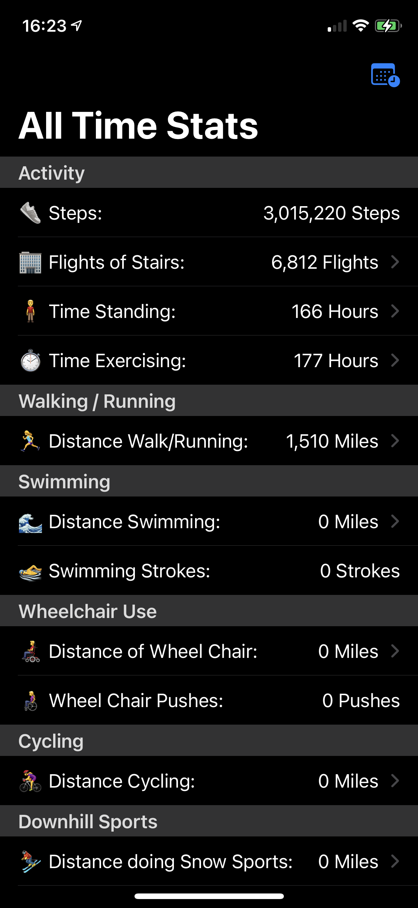
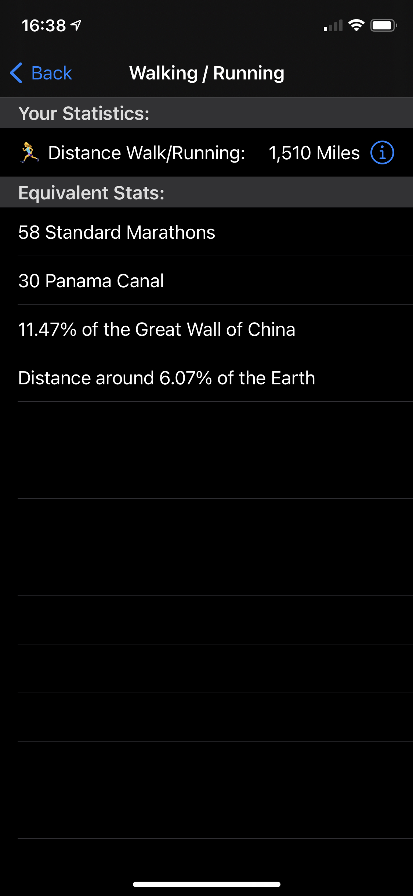
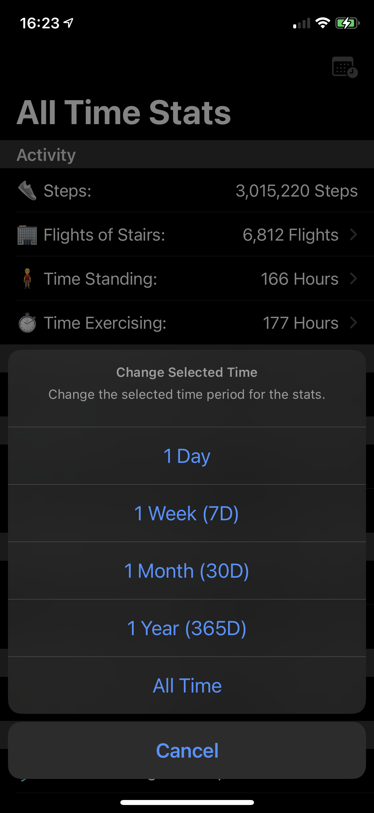
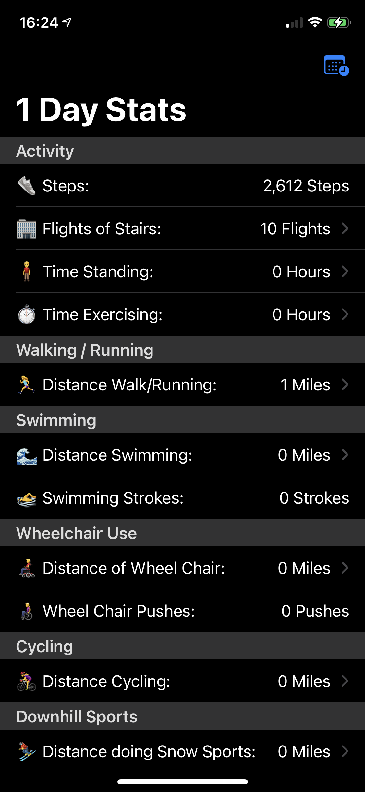
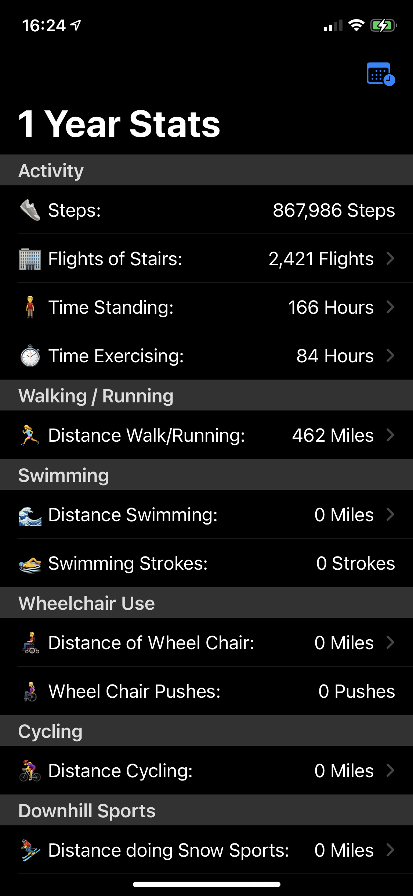
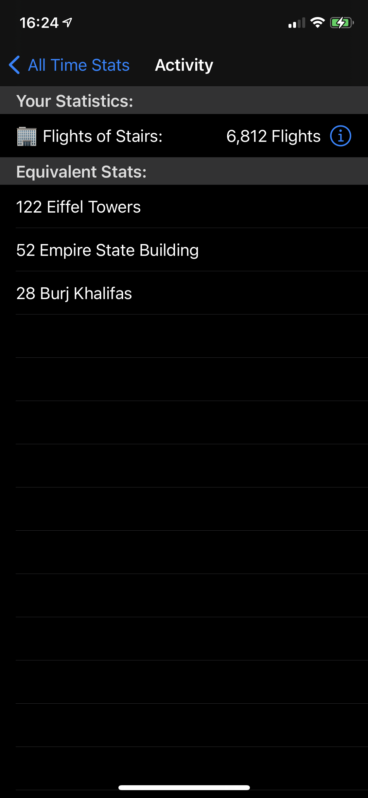
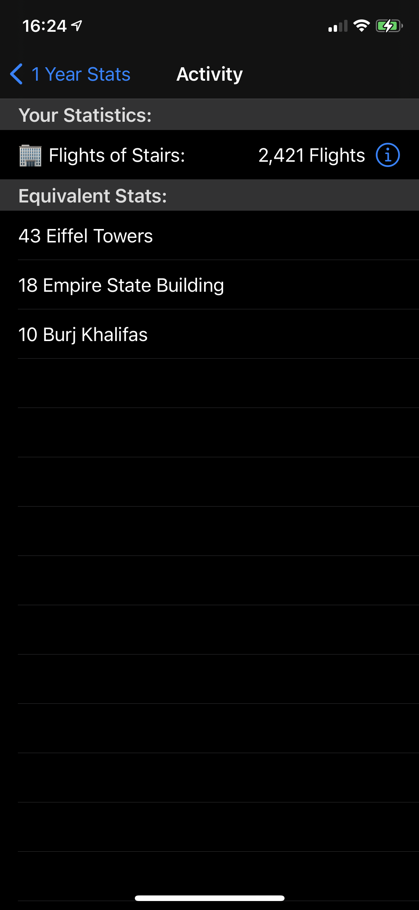
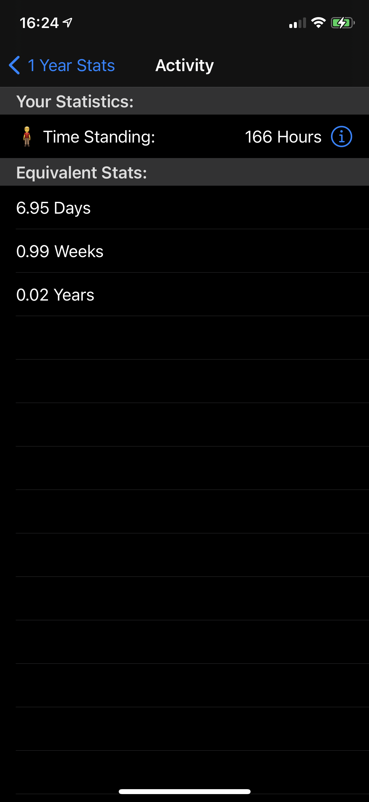

# iOS-HealthKit-Stats
A app that calculates some statistics based on your healthkit data from your iPhone or Apple Watch. Like total distance travelled.

  
    

## Screenshots

  
  
  
  

  
  
  
    

